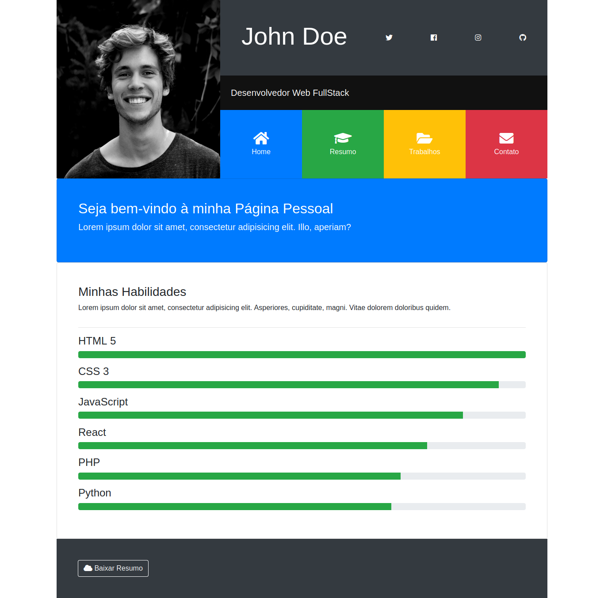

# collapse-portfolio

## Project

***EN:*** This project is a colorful single page portfolio with a collapsing effect on your navigation that shows information about a fictional web developer. It was created during the Bootstrap 4 From Scratch With 5 Projects course, taught by Brad Traversy.

***PT-BR:*** Este projeto é um portfólio colorido de uma única página com um efeito colapso em sua navegação que mostra informações sobre um desenvolvedor web fictício. Foi criado durante o curso Bootstrap 4 From Scratch With 5 Projects, ministrado por Brad Traversy.

## Specifications
- Added a grid header with a profile image, some information, social icons and collapsing navigation embed
- Added a simple footer
- Added the home collapse content with progress bar about skills
- Added the resume collapse content with previous employments
- Added the work collapse content with a works gallery that shows a light box modal when clicked on any of the items
- Added the contact collapse content with a contact form
***

## Technologies

This project was developed with the following technologies:

- HTML
- CSS
- Bootstrap
- JQuery
***
 
## Preview

***

## License

This project is under the MIT license.
